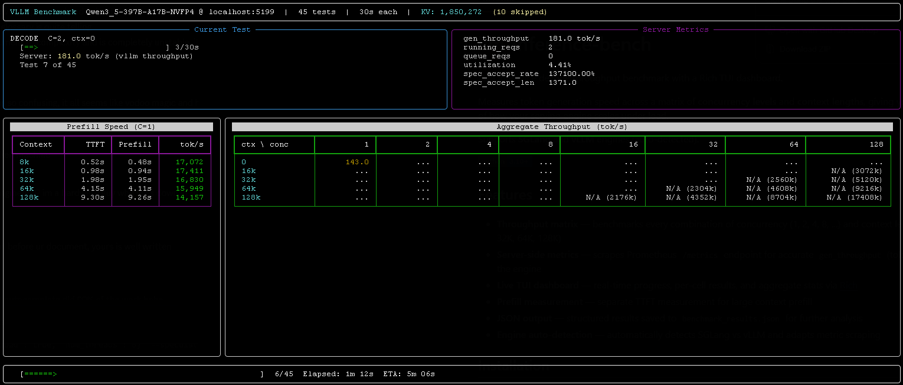

# llm-inference-bench

LLM inference decode throughput benchmark with a Rich TUI dashboard.

Measures token generation speed across a matrix of **concurrency levels** and **context lengths**, giving you a full picture of how your serving engine scales under load.

Supports **SGLang** and **vLLM** engines (auto-detected). Works with any OpenAI-compatible API (OpenRouter, Together AI, etc.).




## Features

- **Throughput matrix** — benchmarks every combination of concurrency (1, 2, 4, 8, ...) and context length (0K, 16K, 32K, 64K, 128K)
- **Three benchmark layers** — prefill, sustained decode, and optional Burst / E2E decode
- **Two decode entry points** — default duration-based Sustained Decode, plus request-count `--request-count` Burst / E2E-only mode
- **Inline client latency detail** — aggregate decode cells can show `tok/s + TTFT/ITL` when there is enough terminal width
- **Server-side validation** — optionally scrapes Prometheus `/metrics` for vLLM/SGLang validation, queue, KV, and scheduler signals
- **Live TUI dashboard** — adaptive Rich layout with compact modes for narrower terminals
- **Live hardware panel** — GPU temperature, SM/memory utilization, VRAM usage, watts, clocks, PCIe rx/tx, plus CPU utilization/frequency
- **Event log** — right-side live history of warmup, readiness, skips, and cell completion while the dashboard redraws
- **Prefill measurement** — integrated decode scout prefill by default, using client `prompt_tokens / TTFT`, with optional standalone cold-prefill profiling and live ETA for long-prefill rows
- **Effective concurrency detection** — shows `(X/Y)*` when the server cannot actually run all requested concurrent requests
- **Dynamic warmup** — uses scheduler metrics when available, with an OpenAI stream fallback when `/metrics` is disabled
- **JSON output** — structured results saved to `benchmark_results.json` for further analysis
- **Smart test skipping** — reads KV cache budget from the server, automatically skips over-capacity cells
- **Engine auto-detection** — automatically detects SGLang vs vLLM and adapts metric scraping
- **Auto-update** — checks GitHub for new versions on startup, offers one-click upgrade

## Installation

See [CHANGELOG.md](CHANGELOG.md) for versioned methodology changes.

```bash
pip install httpx rich psutil
```

## Usage

```bash
# Default: localhost:5000, tests concurrency 1-128, contexts 0K-128K
python3 llm_decode_bench.py

# Custom port and parameters
python3 llm_decode_bench.py --port 5199 --concurrency 1,2,4 --contexts 0,16384

# Custom max tokens and test duration
python3 llm_decode_bench.py --port 5001 --max-tokens 4096 --duration 60

# Full standalone cold-prefill profile when debugging long-context ingest
python3 llm_decode_bench.py --port 5001 \
    --standalone-prefill --prefill-contexts 8k,16k,32k,64k,128k

# Burst / E2E-only mode: exactly N measured requests per cell
python3 llm_decode_bench.py --port 5001 --skip-prefill \
    --contexts 0 --concurrency 1,4 \
    --request-count 40 --warmup-request-count 4 --max-tokens 64

# Full report: prefill + sustained decode + short Burst / E2E section
python3 llm_decode_bench.py --port 5001 \
    --concurrency 1,4,8 --contexts 0,16k \
    --duration 30 --run-burst --burst-requests-per-concurrency 5

# Remote API with authentication (OpenRouter, Together AI, etc.)
python3 llm_decode_bench.py --host https://openrouter.ai --api-key sk-or-... --model meta-llama/llama-3-70b

# Skip prefill phase for quick decode-only testing
python3 llm_decode_bench.py --skip-prefill --concurrency 1,2,4 --contexts 0

# Manual KV cache budget (for vLLM where auto-detection is unreliable)
python3 llm_decode_bench.py --port 5199 --kv-budget 692736
```

### Arguments

| Argument | Default | Description |
|---|---|---|
| `--host` | `localhost` | Server hostname or full URL (e.g. `https://openrouter.ai`) |
| `--port` | `5000` | Server port (ignored when `--host` is a URL) |
| `--api-key` | | API key sent as `Authorization: Bearer` header |
| `--model` | `Qwen3.5` | Model name for API requests (auto-detected from server) |
| `--concurrency` | `1,2,4,8,16,32,64,128` | Comma-separated concurrency levels |
| `--contexts` | `0,16384,32768,65536,131072` | Comma-separated context lengths (tokens) |
| `--max-tokens` | `2048` | Max tokens to generate per request |
| `--duration` | `30` | Duration per decode test cell (seconds) |
| `--prefill-contexts` | `8k,64k,128k` | Extra scout prefill contexts in default mode; standalone profile contexts with `--standalone-prefill` |
| `--prefill-metric` | `client` | Prefill headline source: `client`, `auto`, or `prometheus`. `auto` adds Prometheus validation when available |
| `--standalone-prefill` | `false` | Run the old repeated cold-prefill profile before decode |
| `--request-count` | `0` | Burst / E2E-only mode: measured requests per cell. `0` keeps Sustained Decode as the primary mode |
| `--warmup-request-count` | `0` | Warmup requests to discard before each `--request-count` cell |
| `--run-burst` | `false` | After sustained decode, run an additional short Burst / E2E matrix |
| `--burst-request-count` | `0` | Measured requests per Burst / E2E cell. `0` means `concurrency × --burst-requests-per-concurrency` |
| `--burst-warmup-request-count` | `0` | Warmup requests per Burst / E2E cell. `0` means `concurrency` |
| `--burst-requests-per-concurrency` | `5` | Auto Burst / E2E measured request multiplier |
| `--hw-monitor-interval` | `2` | Live CPU/GPU hardware sampling interval in seconds |
| `--hw-gpu-limit` | `8` | Maximum GPUs shown in the live hardware panel |
| `--no-hw-monitor` | `false` | Disable live hardware sampling |
| `--output` | `benchmark_results.json` | Output file path |
| `--kv-budget` | `0` | KV cache budget in tokens (0 = auto-detect) |
| `--skip-prefill` | | Skip prefill reporting entirely |

## Measurement Methodology

### Prefill

Prefill measures input processing speed. By default, prefill is based on scout
requests. Every non-zero decode context already sends one scout request to
populate the prefix cache before the measured decode cell, and the tool records
that scout as a prefill sample. Contexts listed in `--prefill-contexts` that are
not part of the decode matrix are measured once as lightweight scout-only
samples, so default runs still include the 8k sanity point without restoring the
old repeated standalone prefill phase.

The headline metric is client-side `prompt_tokens / TTFT`. If the engine exports
clean Prometheus prefill counters, standalone mode can also print a server-side
validation value.

Default integrated prefill contexts are the union of the non-zero decode
contexts from `--contexts` and the configured `--prefill-contexts`. This removes
the old extra repeated prefill phase from normal runs while still showing ingest
numbers for the exact prompts used by decode and the small 8k sanity point.

Use `--standalone-prefill --prefill-contexts 8k,16k,32k,64k,128k` when you need
the old repeated cold-prefill curve.

Use this section to compare long-context ingest speed. Do not mix it with decode
throughput; they stress different parts of the engine.

### Sustained Decode

Sustained Decode is the default duration-based benchmark. Each matrix cell runs
for `--duration` seconds after warmup and keeps the requested concurrency
saturated by restarting streams as they finish.

Aggregate decode throughput uses OpenAI stream usage by default. For local
vLLM/SGLang this is exact when `continuous_usage_stats` is supported, because
the stream exposes cumulative `completion_tokens` during the measured window.
Prometheus generation counters are still collected as validation and for
scheduler/effective-concurrency state, but they are not the default headline
metric. If continuous usage is not available, the tool falls back to streamed
content chunks and marks the aggregate source in JSON.

Prometheus `/metrics` is optional. If SGLang is started without
`--enable-metrics`, or if a remote server does not expose metrics, the benchmark
prints a visible warning and continues with OpenAI stream metrics. In that mode,
scheduler/effective-concurrency, KV auto-detection from metrics, and Prometheus
validation fields are unavailable.

Use this section as the main tuning/regression signal for kernels, NCCL, DCP,
MTP, scheduler, and KV-cache changes. It answers: "How much decode throughput
can the engine sustain once it is already running this concurrency?"

### Burst / E2E Decode

Burst / E2E Decode is a finite client-facing request burst. It sends a fixed
number of measured requests, waits until they complete, and reports:

```text
sum(completion_tokens) / profiling_wall_time
```

Enable it after the sustained matrix with `--run-burst`. By default it sends
`concurrency × 5` measured requests and `concurrency` warmup requests per cell.
Override with `--burst-request-count` and `--burst-warmup-request-count`.

Use this section for community-facing "what happens if I throw a
batch of N requests at the server?" numbers. It includes admission, scheduling,
prefill/cache effects for that finite burst, and completion behavior. It should
be compared separately from Sustained Decode.

### Request-Count Only Mode

`--request-count N` switches the primary decode cells to a request-count
Burst / E2E-only model:

- Send `--warmup-request-count` requests first and discard them.
- Send exactly `N` measured requests per cell.
- Wait for all measured requests to complete.
- Compute aggregate throughput as `sum(completion_tokens) / profiling_wall_time`.

This mode requests only final OpenAI usage chunks, not continuous usage chunks,
so its request payload matches AIPerf-style finite burst measurements more
closely. Continuous usage is reserved for duration-based Sustained Decode where
the tool must measure inside an open time window.

This mode is best when you want only finite request bursts without running the
Sustained Decode matrix. For full reports, prefer `--run-burst` so both
Sustained Decode and Burst / E2E Decode are present and labeled separately.

If `--run-burst` is not set, the final report prints an explicit Phase 3 note:
`Burst / E2E Decode: Not run`. This is the default to avoid doubling the runtime
of a full matrix accidentally.

### Client Latency Metrics

Client latency metrics follow OpenAI streaming semantics in both modes:

- TTFT is time from request start to first streamed content token.
- TTST is time from first streamed content token to second streamed content token.
- Request latency ends at the last streamed content token, not at the usage-only chunk or HTTP close.
- ITL is `(last_content_token_time - first_content_token_time) / (output_tokens - 1)`.
- Per-user output throughput is `1 / ITL`.

Sustained-duration cells may stop streams at the measurement boundary. In that
case ITL is still valid if at least two content tokens were observed, because it
uses only first/last received token timestamps and never uses cancel or HTTP
close time as a synthetic last token. Full request latency remains available
only for completed streams.

The main aggregate matrix keeps latency compact: a wide terminal shows cells
like `63.1 1k/14`, meaning aggregate decode throughput `63.1 tok/s`, TTFT
`~1000 ms`, and ITL `14 ms`. Per-request throughput and request latency are
shown in separate per-cell matrices. Completion/sample counts are preserved in
JSON but intentionally not printed in the default report because they are mostly
diagnostic and easy to misread as benchmark failures.

### Live Hardware Panel

The live dashboard samples `nvidia-smi` while the benchmark runs. It shows GPU
SM utilization, memory-controller utilization, VRAM used/total, watts/power
limit, temperature, SM/memory clocks, PCIe rx/tx MB/s, and CPU utilization.

VRAM usage and memory-controller utilization are intentionally separate: VRAM is
capacity pressure, while `Mem` is memory-controller activity. PCIe rx/tx comes
from `nvidia-smi dmon -s t`; treat it as a coarse live diagnostic signal, not a
per-collective NCCL profiler.

When hardware sampling is active, every measured decode cell also gets a compact
hardware summary in JSON and in the final report. Startup diagnostics are saved
to JSON as well: benchmark arguments, relevant `NCCL_`/`VLLM_`/`SGLANG_`/`CUDA_`
environment variables, `uname`, GPU query output, and `nvidia-smi topo -m`.

### Prefill Metrics

Prefill headline throughput is client `prompt_tokens / TTFT`. In the default
mode these samples come from decode scout requests plus any scout-only extra
contexts, so the benchmark no longer pays for a repeated standalone prefill
phase. If Prometheus exposes uncontaminated prefill counters, standalone prefill
mode can also show server-side throughput as validation. Prometheus is not
required for the headline prefill number.

See [methodology and tool parity notes](docs/aiperf-parity-report-2026-04-26.md) for current comparison data and known workload-parity limits.

## Output

Results are saved as JSON with metadata and per-cell throughput data:

```json
{
  "metadata": {
    "version": "0.4.5",
    "engine": "vllm",
    "model": "Qwen3_5-397B-A17B-NVFP4",
    "timestamp": "2026-03-13T00:30:53",
    "decode_mode": "duration",
    "primary_decode_layer": "sustained_decode",
    "request_count": 0,
    "warmup_request_count": 0,
    "run_burst": true,
    "burst_e2e_status": "enabled",
    "concurrency_levels": [1, 2, 4, 8, 16, 32, 64, 128],
    "context_lengths": [0, 16384, 32768, 65536, 131072]
  },
  "prefill": { ... },
  "results": [ ... ],
  "summary_table": { ... },
  "burst_results": [ ... ],
  "burst_summary_table": { ... },
  "methodology": { ... }
}
```

## Additional tools

### `llm_cjk_watchdog.py` — CJK character leak detector

A standalone streaming watchdog that runs chat completions against any OpenAI-compatible endpoint and watches for unexpected Chinese / CJK Han ideographs in the output. Useful for catching model drift, KV-cache corruption, quantization damage, or other failure modes where an English task starts emitting Chinese tokens.

```bash
# single shot against local SGLang/vLLM on :5000
python3 llm_cjk_watchdog.py

# loop until the model leaks a Chinese character
python3 llm_cjk_watchdog.py --loop

# remote OpenAI-compatible endpoint
python3 llm_cjk_watchdog.py --host https://api.together.xyz \
    --api-key $TOGETHER_API_KEY --model meta-llama/llama-3-70b

# simulate a 40k-token input context
python3 llm_cjk_watchdog.py --context-tokens 40000 --max-tokens 2000
```

Features:

- **Loop mode** — runs indefinitely, aborts the stream the moment a CJK character appears
- **Two-row live overlay** pinned to the bottom of the terminal: row 1 shows the current iteration's live tok/s, tokens, elapsed time, and CJK counter; row 2 shows last-iteration and cumulative stats so they never scroll away
- **Precise tok/s** — uses `stream_options.continuous_usage_stats` so the live readout is the exact `completion_tokens` reported by the server, not an estimate from chunk counts
- **Padding context** — optional synthetic input of configurable token size to reproduce long-context failure modes
- **Exit code 2** when CJK characters are detected (scripting-friendly)

Requires only `requests`. See `python3 llm_cjk_watchdog.py --help` for the full CLI.

## License

MIT
